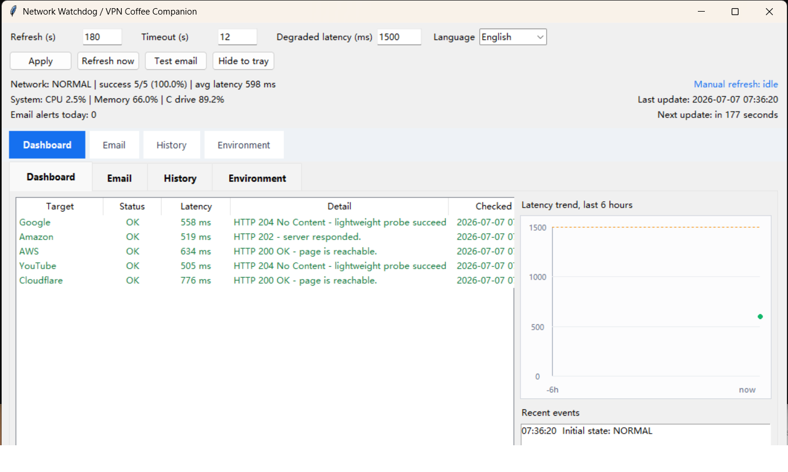

# Network Watchdog / VPN Coffee Companion

Current stable version: `1.1.0`

Windows 10 / 11 desktop watchdog for checking whether the local machine can reach selected external websites over real HTTPS requests, while also tracking local CPU, memory, and C drive usage.

仅适用于 Windows 10 / 11 的桌面看门狗工具，第二名称为 `VPN 咖啡伴侣`。它会用真实 HTTPS 请求定期检测本机访问外部网站是否通畅，同时监控本机 CPU、内存和 C 盘占用率。



## Scope

This project is only intended for Windows 10 and Windows 11 local desktop monitoring.

The current notification path is intentionally narrow:

- Email notifications are currently designed for Mainland China usage
- QQ Mail SMTP is the supported notification mailbox path
- A QQ Mail authorization code is required to receive notifications

当前项目仅适用于 Windows 10 / 11 本机桌面监控。

目前的通知方案有明确范围：

- 邮件通知当前面向中国内地使用场景
- 通知邮箱链路当前支持 QQ 邮箱 SMTP
- 要收到通知，必须使用 QQ 邮箱授权码，而不是邮箱登录密码

## English Overview

`Network Watchdog`, also referred to as `VPN Coffee Companion`, is a lightweight local monitoring tool for users who want a visible desktop status panel instead of a full monitoring platform.

It is designed for this workflow:

- Probe Google, Amazon, AWS, YouTube, Cloudflare, or custom targets with real HTTPS requests
- Show current status, latency, and a friendly explanation of HTTP results
- Keep a 6-hour latency chart on the main screen
- Track CPU, memory, and C drive usage on the same refresh interval
- Send email alerts for degraded network status, outages, or high system resource usage
- Run as a Windows 10 / 11 desktop app with optional tray mode

## 中文说明

`Network Watchdog`，也就是 `VPN 咖啡伴侣`，是一个偏轻量、本机常驻的监控工具，适合希望直接在桌面看到状态，而不是搭一整套监控平台的场景。

它主要解决这类问题：

- 用真实 HTTPS 请求探测 Google、Amazon、AWS、YouTube、Cloudflare 或自定义目标
- 显示当前状态、延迟，以及对 HTTP 返回结果的简单说明
- 在主界面展示最近 6 小时的网络延迟曲线
- 按同一刷新周期同步监控 CPU、内存和 C 盘占用率
- 当网络异常或系统资源过高时通过邮件发送告警
- 作为 Windows 10 / 11 桌面程序运行，支持托盘常驻

## Features

- Manual refresh with visible in-progress and completed feedback
- Adjustable refresh interval and timeout
- Friendly HTTP detail text for common responses such as `200` and `204`
- Dashboard latency chart for the last 6 hours
- Full history chart for the last 6 hours
- CPU, memory, and C drive usage monitoring
- Email alerts for degraded network state, outages, and high system resource usage
- Daily email alert counter on the main screen
- English UI by default, with Chinese language switch
- Automatic SMTP path fallback between SSL `465` and STARTTLS `587`
- Environment self-check page for portable deployment on another machine
- Windows installer packaging with a directory-based runtime layout

## Screens and Modes

- `Dashboard`: network table, recent events, 6-hour mini chart, summary counters
- `Email`: SMTP settings, alert settings, test email, language switch, system alert threshold
- `History`: larger 6-hour chart
- `Environment`: dependency checks and portable setup hints
- `Updates`: current version, latest GitHub release, package list, and download links

## Run From Source

```powershell
python -m pip install -r requirements.txt
python network_watchdog.py
```

You can also use:

```powershell
run_watchdog.bat
```

## Configuration

- `watchdog_targets.json`: probe targets
- `watchdog_settings.example.json`: public example settings file
- `watchdog_settings.json`: local private settings file, intentionally ignored by git
- `logs/network_watchdog_log.csv`: local runtime log, intentionally ignored by git

## Installer

Build the installer package:

```powershell
powershell -NoProfile -ExecutionPolicy Bypass -File .\build_installer.ps1
```

Output files:

- `release/SetupNetworkWatchdog.exe`
- `release/NetworkWatchdogInstaller.zip`
- `release/SetupNetworkWatchdogLite.exe`
- `release/NetworkWatchdogLite.zip`

The runtime package uses PyInstaller `onedir` mode instead of `onefile` mode to reduce antivirus false positives.

## Package Types

- `Full`: includes the private Python runtime and desktop dependencies, larger size, best for direct installation on another Windows 10 / 11 machine
- `Semi-Lite`: packaged as a single `exe`, does not include the full private Python runtime, prepares a local virtual environment on the target machine
- `Lite`: does not include Python, much smaller, best when the target machine already has Python 3.10+ or when you want to install dependencies locally with `install_lite.bat`

## Release Notes

### v1.1.0

- Added a dedicated `Updates` page
- Checks the latest GitHub release, shows current vs latest version, lists downloadable packages, and can open the release page or a selected asset
- Added an option to check for updates automatically on startup

### v1.0.9

- Clarified recovery email wording so it reflects the configured success threshold instead of implying all targets are fully restored
- Recovery emails now include OK targets, total targets, minimum required targets, success rate, and average latency

### v1.0.8

- Added a dedicated slow-network email alert threshold input, defaulting to `2000 ms`
- Sends an email only when average latency reaches the threshold for 2 consecutive checks
- The alert message now includes bilingual wording for slow network speed

### v1.0.7

- Added a third `Semi-Lite` package as a real `exe`
- The semi-lite installer unpacks the lightweight files and prepares a local virtual environment automatically
- Kept the existing `Full` and raw `Lite` packages available side by side

### v1.0.6

- Added a second lightweight release package without the bundled Python runtime
- Kept the existing full installer package for direct deployment on another machine
- Added `install_lite.bat` so the lightweight package can create its own local virtual environment

### v1.0.5

- Added configurable `Minimum OK targets`, defaulting to `2`
- Changed network state logic so partial target failures do not alert if the minimum success count is still met
- Disabled popup alerts by default and migrated older saved settings away from the old popup default

### v1.0.4

- Added Windows single-instance protection to prevent duplicate app windows
- Prevented stacked popup alerts when another warning dialog is already open
- Kept the packaged desktop behavior aligned with the installer release

### v1.0.3

- Added explicit versioning in the desktop application
- Fixed packaged HTTPS probing by using a bundled certificate chain via `certifi`
- Switched the default Cloudflare probe target to a more automation-friendly endpoint
- Kept the bilingual README and English UI screenshot in sync with the public repository

## Why The Installer Is 30+ MB

The installer size is expected.

- This project is a desktop application, not a single Python script
- The package includes a private Python runtime so the target machine does not need Python preinstalled
- It also bundles Tkinter UI support, image libraries, system monitoring libraries, and the Windows runtime files needed by PyInstaller
- The package uses `onedir` mode instead of ultra-compressed `onefile` mode to reduce antivirus false positives

In short, the installer is larger because it carries the application and its runtime together for easier deployment on another Windows 10 / 11 machine.

## 为什么安装包有 30 多 MB

这个体积是正常的。

- 这个项目是桌面程序，不是单个 Python 脚本
- 安装包里自带了一套 Python 运行时，目标机器不需要提前安装 Python
- 同时还打包了 Tkinter 界面组件、图像库、系统监控库，以及 PyInstaller 在 Windows 下运行所需的运行时文件
- 当前采用的是 `onedir` 目录模式，而不是高度压缩的 `onefile` 单文件模式，这样做是为了尽量降低杀毒软件误报概率

简化来说，这个安装包之所以更大，是因为它把程序本体和运行环境一起带上了，方便在另一台 Windows 10 / 11 机器上直接安装运行。

## Email Notes

For QQ Mail SMTP delivery:

- Host: `smtp.qq.com`
- Sender email: full mailbox address such as `name@qq.com`
- Auth code: mailbox authorization code, not the login password

The app automatically tries supported SMTP delivery paths in the background, but the intended public support target is Mainland China plus QQ Mail.

## Privacy and Publishing Notes

- Real mailbox credentials must never be committed
- `watchdog_settings.json` is ignored by git
- Build outputs and logs are ignored by git
- Public releases should be created from sanitized defaults only

## License

MIT
